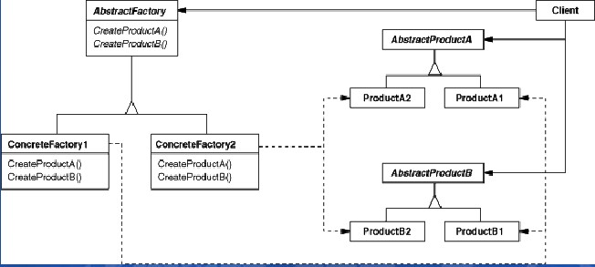

#抽象工厂模式 / Abstract Factory

对象创建型模式，创建产品系列。

##模式图

抽象工厂的一个方法创建一种产品



##特点

优点：

+ 分离了具体类
+ 易于交换产品系列
+ 有利于产品的一致性

缺点：

+ 难以支持新产品

##例子

```
#include <iostream>
#include <string>

using namespace std;

class AbstractProductA {
public:
    virtual void fly() = 0;
};

class ConcreteProductA1 : public AbstractProductA {
public:
    virtual void fly() override {
        cout << __FUNCTION__ << endl;
    }
};

class ConcreteProductA2 : public AbstractProductA {
public:
    virtual void fly() override {
        cout << __FUNCTION__ << endl;
    }
};

class AbstractProductB {
public:
    virtual void run() = 0;
};

class ConcreteProductB1 : public AbstractProductB {
public:
    virtual void run() override {
        cout << __FUNCTION__ << endl;
    }
};

class ConcreteProductB2 : public AbstractProductB {
public:
    virtual void run() override {
        cout << __FUNCTION__ << endl;
    }
};


class AbstractFactory {
public:
    virtual AbstractProductA* createProductA() = 0;
    virtual AbstractProductB* createProductB() = 0;
};

class ConreteFactory1 : public AbstractFactory {
public:
    virtual AbstractProductA* createProductA() {
        return new ConcreteProductA1;
    }
    virtual AbstractProductB* createProductB() {
        return new ConcreteProductB1;
    }
};


class ConcreteFactory2 : public AbstractFactory {
    virtual AbstractProductA* createProductA() {
        return new ConcreteProductA2;
    }
    virtual AbstractProductB* createProductB() {
        return new ConcreteProductB2;
    }
};


int main() {
    AbstractFactory* f = new ConreteFactory1();
    f->createProductA()->fly();
    f->createProductB()->run();
}
```
