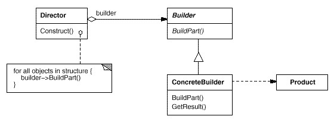

#生成器模式/Builder

对象创建型模式，将复杂对象的构建与它的表示分离，使同样的构建过程可以创建不同的表示。

##模式图

##特点

+   隐藏了产品的内部表示

    builder提供创建产品的接口给director（导向器）。
    builder隐藏了产品的内部结构，也隐藏了产品是如何装配的。

+   将构造代码和表示代码分开

+   精确控制产品的创建

    director负责控制产品的创建和装配过程，并返回产品，client不关注产品的构建过程。
