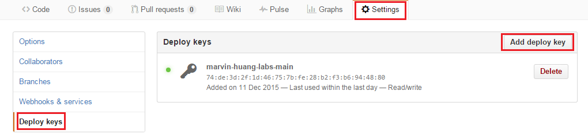

#git ssh配置

##设置user和email

```
git config --global user.name xxx
git config --global user.email xxxx@gmail.com
```


##创建ssh密钥

```
cd ~/.ssh
#创建过程会要求输入密码，如果不需要密钥，直接回车
#会生成两个文件id_rsa和id_rsa.pub
ssh-keygen -t rsa -C “xxxx@gmail.com”
ssh-add id_rsa
```

##配置ssh config

在~/.ssh下创建config

```
#设置代理
#ProxyCommand connect.exe -H hostname:port %h %p
host github.com
    user git
    #port 443
    hostname ssh.github.com
    identityfile ~/.ssh/id_rsa
```

##在github添加公钥



##测试

```
#ssh user@host
ssh git@github.com
```


##clone

```
#git clone user@host:xxx/proj.git
git clone git@github.com:marvin-h/ks.git
```

##配置多个ssh key

可用[ssh-keygen -f](../ssh/ssh-keygen.md)生成多对密钥，并配置[config](../ssh/ssh.md)
使用git clone的时候，url要指定正确