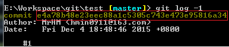

#git tag

标签操作
标签不会自动推送到远程仓库，需要git push手动推送

##命令

###git tag

列出现有标签

###git tag -l format

列出匹配特定模式的标签

```
git tag -l 'v1.4.*'
```

###git tag tagname

创建轻量级标签

```
git tag v0.0.1
```

###git tag -a tagname -m comments

创建含附注的标签

```
git tag -a v0.0.1 -m 'xxx'
```

###git tag -s tagname -m comments

签署标签，需要私钥


###git tag -v tagname

验证标签，需要公钥

###git tag -a tagname identity

对某个提交补加标签

先用git log找出identity（对象校验和）


打标签时加上校验和（或前几位）
```
git tag -a v1.1 e4a78
```