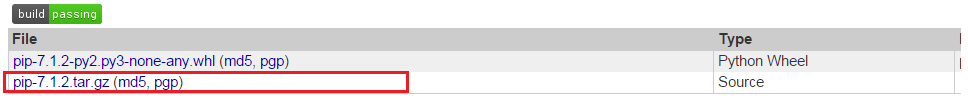

#python包管理器

##手工安装

1. 下载安装包
    
2. 解压进入目录
3. 执行`python setup.py install`

##包

###setuptools

[pypi](https://pypi.python.org/pypi/setuptools#downloads)

###pip

[pypi](https://pypi.python.org/pypi/pip)

###selenium

[pypi](https://pypi.python.org/pypi/selenium#downloads)

###misaka

[github](https://github.com/FSX/misaka)

###Pygments

[pypi](https://pypi.python.org/pypi/Pygments)